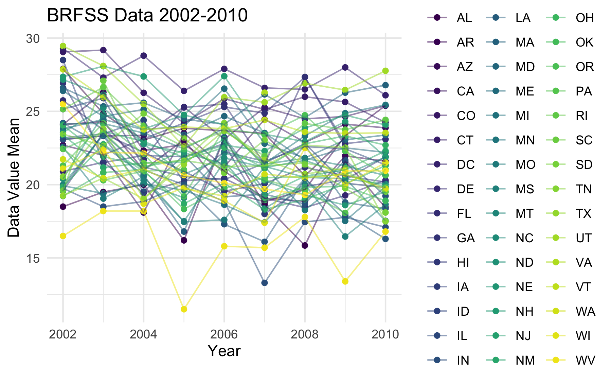

### Setup Code

```{r setup, message = FALSE}
library(tidyverse)

knitr::opts_chunk$set(
  fig.width = 6,
  fig.asp = .6,
  out.width = "90%"
)

theme_set(theme_minimal() + theme(legend.position = "bottom"))

options(
  ggplot2.continuous.colour = "viridis",
  ggplot2.continuous.fill = "viridis"
)

scale_colour_discrete = scale_colour_viridis_d
scale_fill_discrete = scale_fill_viridis_d
```

### Problem 1

```{r}
library(p8105.datasets)
data("instacart")
```

The instacart dataset is quite large, with 15 columns and 1384617 rows. The table is structured with each row corresponding to a single item ordered from instacart and the associated information for that single item. Some key variables are "order_id," "user_id," "product_name," "aisle_id," department_id," "aisle," and "department." For example, the first item in the table is given the number 1, order_id is 1, user_id is 112108, product_name is Bulgarian Yogurt, aisle_id is 120, department_id is 16, aisle is yogurt, and department is dairy eggs. As made clear by this example, important variables take both numeric and alphabetic forms. Certain columns will also be made up of distinct data while others will have a few highly repeated categories. 

```{r}
aisle_df = instacart %>% 
  group_by(aisle) %>% 
  summarize(aisle_obs = n()) %>% 
  arrange(desc(aisle_obs))
```

There are 134 aisles with "fresh vegetables," "fresh fruits," and "packaged vegetables fruits" as the three most popular in terms of items ordered.

```{r}
aisle_plot = aisle_df %>% 
  filter(
    aisle_obs > 10000
  ) %>% 
  ggplot(aes(x = aisle, y = aisle_obs)) +
  geom_point()
```

Most of the data points are below 40,000 in this plot, with only 5 aisles that have more than 40,000 items ordered

```{r}
popular_item_df = 
  instacart %>% 
  filter(
    aisle %in% c("baking ingredients", "dog food care", "packaged vegetables fruits")
  ) %>% 
  group_by(aisle) %>% 
  count(product_name, name = "product_count") %>% 
  mutate(
    items_rank = min_rank(desc(product_count))
  ) %>% 
  filter(items_rank <= 3) %>% 
  select(-items_rank)

  knitr::kable(popular_item_df, format = "html")
```

The most popular item in the baking ingredients aisle is Light Brown Sugar (499 orders), the most popular in dog food care is "Snack Sticks Chicken & Rice Recipe Dog Treats" (30 orders), and the most poular in packaged vegetables fruits is "Organic Baby Spinach" (9784 orders).

```{r, message = FALSE}
apple_icecream_df = instacart %>% 
  mutate(
    order_dow =
      recode(
      order_dow,
      "0" = "Sunday",
      "1" = "Monday",
      "2" = "Tuesday",
      "3" = "Wednesday",
      "4" = "Thursday",
      "5" = "Friday",
      "6" = "Saturday"
    )
  ) %>% 
  group_by(product_name, order_dow) %>% 
  filter(
    product_name %in% c("Pink Lady Apples", "Coffee Ice Cream")
    ) %>% 
  summarize(mean_hour_day = mean(order_hour_of_day)) %>%
  mutate(
    day_of_week = ordered(order_dow, c("Sunday", "Monday", "Tuesday", "Wednesday", "Thursday", "Friday", "Saturday"))
  ) %>% 
  arrange(day_of_week) %>% 
  select(-order_dow) %>% 
  pivot_wider(
    names_from = day_of_week,
    values_from = mean_hour_day
  )

knitr::kable(apple_icecream_df, format = "html")
```

For coffee ice cream, the mean hour of ordering is later from Monday through Thursday than Friday through Sunday. Pink Lady Apples don't appear to present any trend for mean times at which they are ordered.

### Problem 2

```{r}
data("brfss_smart2010")

brfss_df = brfss_smart2010 %>% 
  janitor::clean_names() %>% 
  filter(
    topic == "Overall Health",
    response %in% c("Poor", "Fair", "Good", "Very Good", "Excellent")
    ) %>% 
  mutate(
    response =
      recode(
        response,
        "Poor" = "1",
        "Fair" = "2",
        "Good" = "3",
        "Very Good" = "4",
        "Excellent" = "5"
        )
  ) %>% 
      arrange(response) %>%  
  mutate(
        response = 
        recode(
        response,
        "1" = "Poor",
        "2" = "Fair",
        "3" = "Good",
        "4" = "Very Good",
        "5" = "Excellent"
    )
  )
```

```{r}
two_thousand_two_df = brfss_df %>% 
  filter(year == "2002") %>% 
  group_by(locationabbr) %>% 
  summarize(location_obs = n()) %>% 
  filter(location_obs >= 7)

two_thousand_ten_df = brfss_df %>% 
  filter(year == "2010") %>% 
  group_by(locationabbr) %>% 
  summarize(location_obs = n()) %>% 
  filter(location_obs >= 7)
```

In 2002 ony 36 states had 7 or more locations observed. In 2010, that number went up to 45 states. Some states saw increases in the number of locations observed, but some also saw decreases, so it would be inappropriate to say based on this table alone there was a trend in terms of increases or decreases in numbers of locations observed per state.

```{r, warning = FALSE, message = FALSE}
excellent_df = brfss_df %>% 
  filter(response == "Excellent") %>% 
  group_by(year, locationabbr) %>% 
  summarize(data_value_mean = mean(data_value)) %>% 
  ggplot(aes(x = year, y = data_value_mean, group = locationabbr, color = locationabbr)) +
  geom_point() +
  geom_line(alpha = 0.5) +
  theme(legend.position = "right")

ggsave("excellent_plot.png")

```

This spaghetti plot shows that values will both increase as well as decrease across the years for a single state.

```{r}

```


