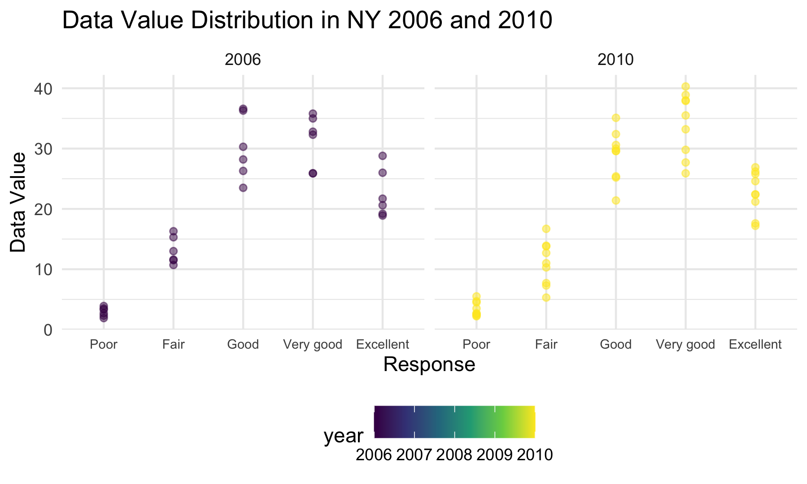

p8105\_hw3\_mjn2142
================
Matthew Neky
10/18/2021

### Setup Code

``` r
library(tidyverse)

knitr::opts_chunk$set(
  fig.width = 6,
  fig.asp = .6,
  out.width = "90%"
)

theme_set(theme_minimal() + theme(legend.position = "bottom"))

options(
  ggplot2.continuous.colour = "viridis",
  ggplot2.continuous.fill = "viridis"
)

scale_colour_discrete = scale_colour_viridis_d
scale_fill_discrete = scale_fill_viridis_d
```

### Problem 1

``` r
library(p8105.datasets)
data("instacart")
```

The instacart dataset is quite large, with 15 columns and 1384617 rows.
The table is structured with each row corresponding to a single item
ordered from instacart and the associated information for that single
item. Some key variables are “order\_id,” “user\_id,” “product\_name,”
“aisle\_id,” department\_id," “aisle,” and “department.” For example,
the first item in the table is given the number 1, order\_id is 1,
user\_id is 112108, product\_name is Bulgarian Yogurt, aisle\_id is 120,
department\_id is 16, aisle is yogurt, and department is dairy eggs. As
made clear by this example, important variables take both numeric and
alphabetic forms. Certain columns will also be made up of distinct data
while others will have a few highly repeated categories.

``` r
aisle_df = instacart %>% 
  group_by(aisle) %>% 
  summarize(aisle_obs = n()) %>% 
  arrange(desc(aisle_obs))
```

There are 134 aisles with “fresh vegetables,” “fresh fruits,” and
“packaged vegetables fruits” as the three most popular in terms of items
ordered.

``` r
aisle_plot = aisle_df %>% 
  filter(
    aisle_obs > 10000
  ) %>% 
  ggplot(aes(x = aisle, y = aisle_obs)) +
  geom_point()
```

Most of the data points are below 40,000 in this plot, with only 5
aisles that have more than 40,000 items ordered

``` r
popular_item_df = 
  instacart %>% 
  filter(
    aisle %in% c("baking ingredients", "dog food care", "packaged vegetables fruits")
  ) %>% 
  group_by(aisle) %>% 
  count(product_name, name = "product_count") %>% 
  mutate(
    items_rank = min_rank(desc(product_count))
  ) %>% 
  filter(items_rank <= 3) %>% 
  select(-items_rank)

  knitr::kable(popular_item_df, format = "html")
```

<table>
<thead>
<tr>
<th style="text-align:left;">
aisle
</th>
<th style="text-align:left;">
product\_name
</th>
<th style="text-align:right;">
product\_count
</th>
</tr>
</thead>
<tbody>
<tr>
<td style="text-align:left;">
baking ingredients
</td>
<td style="text-align:left;">
Cane Sugar
</td>
<td style="text-align:right;">
336
</td>
</tr>
<tr>
<td style="text-align:left;">
baking ingredients
</td>
<td style="text-align:left;">
Light Brown Sugar
</td>
<td style="text-align:right;">
499
</td>
</tr>
<tr>
<td style="text-align:left;">
baking ingredients
</td>
<td style="text-align:left;">
Pure Baking Soda
</td>
<td style="text-align:right;">
387
</td>
</tr>
<tr>
<td style="text-align:left;">
dog food care
</td>
<td style="text-align:left;">
Organix Chicken & Brown Rice Recipe
</td>
<td style="text-align:right;">
28
</td>
</tr>
<tr>
<td style="text-align:left;">
dog food care
</td>
<td style="text-align:left;">
Small Dog Biscuits
</td>
<td style="text-align:right;">
26
</td>
</tr>
<tr>
<td style="text-align:left;">
dog food care
</td>
<td style="text-align:left;">
Snack Sticks Chicken & Rice Recipe Dog Treats
</td>
<td style="text-align:right;">
30
</td>
</tr>
<tr>
<td style="text-align:left;">
packaged vegetables fruits
</td>
<td style="text-align:left;">
Organic Baby Spinach
</td>
<td style="text-align:right;">
9784
</td>
</tr>
<tr>
<td style="text-align:left;">
packaged vegetables fruits
</td>
<td style="text-align:left;">
Organic Blueberries
</td>
<td style="text-align:right;">
4966
</td>
</tr>
<tr>
<td style="text-align:left;">
packaged vegetables fruits
</td>
<td style="text-align:left;">
Organic Raspberries
</td>
<td style="text-align:right;">
5546
</td>
</tr>
</tbody>
</table>

The most popular item in the baking ingredients aisle is Light Brown
Sugar (499 orders), the most popular in dog food care is “Snack Sticks
Chicken & Rice Recipe Dog Treats” (30 orders), and the most poular in
packaged vegetables fruits is “Organic Baby Spinach” (9784 orders).

``` r
apple_icecream_df = instacart %>% 
  mutate(
    order_dow =
      recode(
      order_dow,
      "0" = "Sunday",
      "1" = "Monday",
      "2" = "Tuesday",
      "3" = "Wednesday",
      "4" = "Thursday",
      "5" = "Friday",
      "6" = "Saturday"
    )
  ) %>% 
  group_by(product_name, order_dow) %>% 
  filter(
    product_name %in% c("Pink Lady Apples", "Coffee Ice Cream")
    ) %>% 
  summarize(mean_hour_day = mean(order_hour_of_day)) %>%
  mutate(
    day_of_week = ordered(order_dow, c("Sunday", "Monday", "Tuesday", "Wednesday", "Thursday", "Friday", "Saturday"))
  ) %>% 
  arrange(day_of_week) %>% 
  select(-order_dow) %>% 
  pivot_wider(
    names_from = day_of_week,
    values_from = mean_hour_day
  )

knitr::kable(apple_icecream_df, format = "html")
```

<table>
<thead>
<tr>
<th style="text-align:left;">
product\_name
</th>
<th style="text-align:right;">
Sunday
</th>
<th style="text-align:right;">
Monday
</th>
<th style="text-align:right;">
Tuesday
</th>
<th style="text-align:right;">
Wednesday
</th>
<th style="text-align:right;">
Thursday
</th>
<th style="text-align:right;">
Friday
</th>
<th style="text-align:right;">
Saturday
</th>
</tr>
</thead>
<tbody>
<tr>
<td style="text-align:left;">
Coffee Ice Cream
</td>
<td style="text-align:right;">
13.77419
</td>
<td style="text-align:right;">
14.31579
</td>
<td style="text-align:right;">
15.38095
</td>
<td style="text-align:right;">
15.31818
</td>
<td style="text-align:right;">
15.21739
</td>
<td style="text-align:right;">
12.26316
</td>
<td style="text-align:right;">
13.83333
</td>
</tr>
<tr>
<td style="text-align:left;">
Pink Lady Apples
</td>
<td style="text-align:right;">
13.44118
</td>
<td style="text-align:right;">
11.36000
</td>
<td style="text-align:right;">
11.70213
</td>
<td style="text-align:right;">
14.25000
</td>
<td style="text-align:right;">
11.55172
</td>
<td style="text-align:right;">
12.78431
</td>
<td style="text-align:right;">
11.93750
</td>
</tr>
</tbody>
</table>

For coffee ice cream, the mean hour of ordering is later from Monday
through Thursday than Friday through Sunday. Pink Lady Apples don’t
appear to present any trend for mean times at which they are ordered.

### Problem 2

``` r
data("brfss_smart2010")

brfss_df = brfss_smart2010 %>% 
  janitor::clean_names() %>% 
  filter(
    topic == "Overall Health",
    response %in% c("Poor", "Fair", "Good", "Very good", "Excellent")
    ) %>% 
  mutate(
    response =
      recode(
        response,
        "Poor" = "1",
        "Fair" = "2",
        "Good" = "3",
        "Very good" = "4",
        "Excellent" = "5"
        )
  ) %>% 
      arrange(response) %>%  
  mutate(
        response = 
        recode(
        response,
        "1" = "Poor",
        "2" = "Fair",
        "3" = "Good",
        "4" = "Very good",
        "5" = "Excellent"
    )
  )
```

``` r
two_thousand_two_df = brfss_df %>% 
  filter(year == "2002") %>% 
  group_by(locationabbr) %>% 
  summarize(location_obs = n()) %>% 
  filter(location_obs >= 7)

two_thousand_ten_df = brfss_df %>% 
  filter(year == "2010") %>% 
  group_by(locationabbr) %>% 
  summarize(location_obs = n()) %>% 
  filter(location_obs >= 7)
```

In 2002 ony 36 states had 7 or more locations observed. In 2010, that
number went up to 45 states. Some states saw increases in the number of
locations observed, but some also saw decreases, so it would be
inappropriate to say based on this table alone there was a trend in
terms of increases or decreases in numbers of locations observed per
state.

``` r
excellent_df = brfss_df %>% 
  filter(response == "Excellent") %>% 
  group_by(year, locationabbr) %>% 
  summarize(data_value_mean = mean(data_value)) %>% 
  ggplot(aes(x = year, y = data_value_mean, group = locationabbr, color = locationabbr)) +
  geom_point() +
  geom_line(alpha = 0.5) +
  theme(legend.position = "right")

ggsave("excellent_plot.png")
knitr::include_graphics("excellent_plot.png")
```


This spaghetti plot shows that values will both increase as well as
decrease across the years for a single state.

``` r
ny_df = brfss_df %>% 
  filter(
    locationabbr == "NY",
    year == "2006" | year == "2010"
  ) %>% 
  mutate(
    response = factor(response, levels = c("Poor", "Fair", "Good", "Very good", "Excellent"))
    ) %>% 
  ggplot(aes(x = response, y = data_value, color = year)) +
  geom_point(alpha = 0.5) +
  facet_grid(.~year)

ggsave("ny_plot.png")

```


The two years show similar trends, with “Good” and “Very good” being the
most popular responses, “Excellent” being in the middle, and “Fair” and
“Poor” being the least popular, in terms of the data\_value metric.

### Problem 3

Tidying accelerometer data

``` r
accel_df = read_csv("./accel_data.csv") %>% 
  janitor::clean_names() %>% 
  mutate(
    week_classification = ifelse(day == "Saturday" | day == "Sunday", "Weekend", "Weekday")
  ) %>% 
  relocate(week, day_id, day, week_classification)
```

    ## Rows: 35 Columns: 1443

    ## ── Column specification ────────────────────────────────────────────────────────
    ## Delimiter: ","
    ## chr    (1): day
    ## dbl (1442): week, day_id, activity.1, activity.2, activity.3, activity.4, ac...

    ## 
    ## ℹ Use `spec()` to retrieve the full column specification for this data.
    ## ℹ Specify the column types or set `show_col_types = FALSE` to quiet this message.

Create aggregate variable

``` r
aggregate_accel_df = accel_df %>% 
  mutate(
    aggregate_activity = select(., activity_1:activity_1440) %>% rowSums(na.rm = TRUE)
  ) %>% 
  relocate(week, day_id, day, week_classification, aggregate_activity)
```

ADD TREND COMMENTS.

Accelerometer plot
